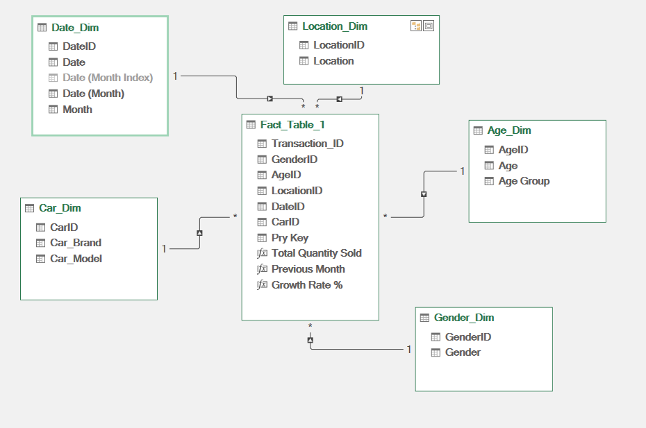
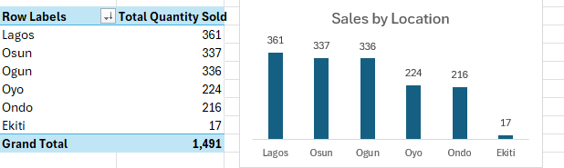
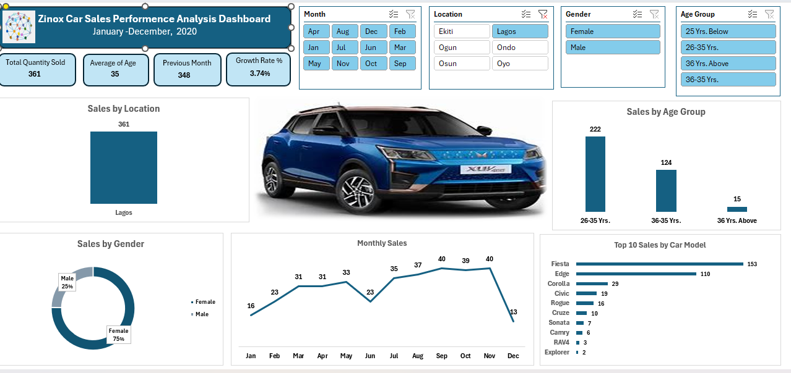
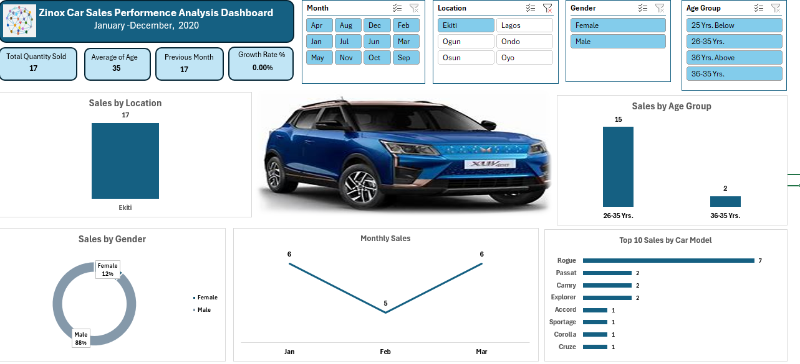
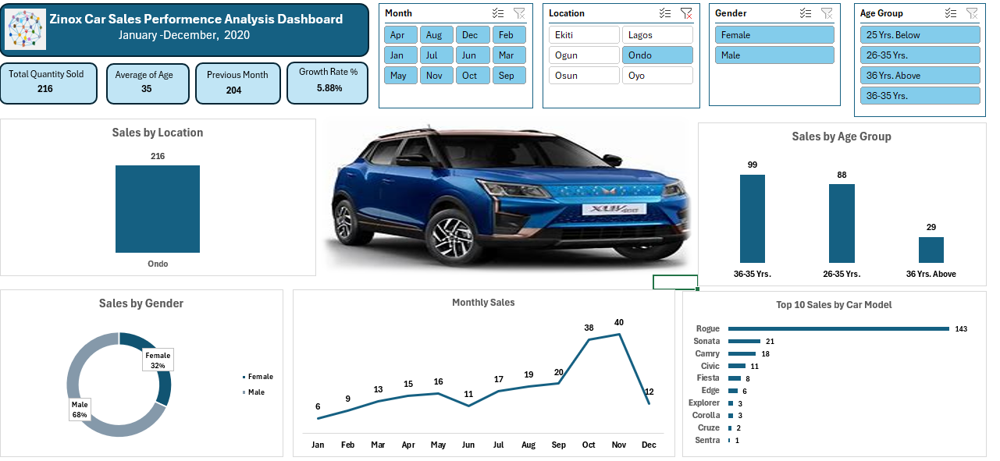
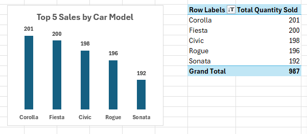
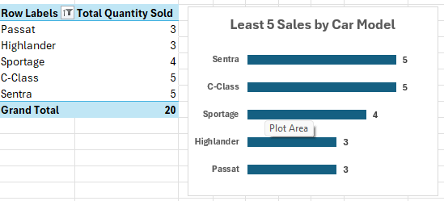
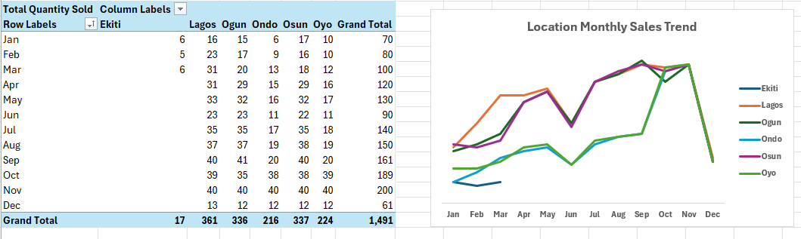

# Zion Car_Sales_Analysis-2020

## Introduction
This data set is about Zion car retailer company with branches across six states in Nigeria charges us with the task of providing insightful business analysis.
They are interested in their sales performance for January - December 2020. 

### Skills/Concepts Applied: 
The following features were incorporated as well as skills:
- Data Analysis(Exploratory, Descriptive, Precriptive)
-  ETL using Power Query
-  Data Modelling (Facts and Dimension Tables),
-  Created Measures using , DAX, Quick Measures (DistinctCount, Sumif, Countif, Unique, 
   Filter, Count, Custom Column etc)
-  Pivot Tables, Charts, Dashboards/Visualisation (Findings and Insights)
-   Presentation and Effective Communication.

## Problem Statement
1.	Sales Performance Analysis: -Dive deep into our sales performance throughout 2020.
- Identify trends in sales volume,
- uncover any seasonality effects, and
- pinpoint peak sales periods.
  
2.	Customer Demographics:
- Gain a comprehensive understanding of our customer base demographics.
- Uncover insights into the age, gender, location, and
- Other relevant characteristics of our customers.
  
3.	Geographical Analysis:
- Analyse the performance of our branches across different regions.
- Identify areas with the highest sales volumes,
- Compare sales performance across branches, and
- Understand regional preferences or market trends.
  
5.	Product Analysis:
- Explore the preferences of our customers regarding car brands and models.
- Identify the top-selling models,
- Analyse the popularity of different car categories, and
- Uncover any trends or patterns in product preferences.
  
## Data Sourcing
Excel file was downloaded after which extracted into a Power BI query for cleaning, transformation, manipulation, analysis, and visualization. The dataset contains a single sheet/table comprising of **1,491 rows and 6 columns**.

## Data Transformation/Cleaning:
Data was efficiently cleaned and transformed with the Power Query Editor, Excel and Power Bi. 
Some of the applied steps included:

- Promote headers
- Duplicated my table
- Creating an “Age Bracket” using the “Age” column. Note the ages are between 24-47 years of age in this dataset. Go to “Add Column – conditional Column” and create the Age Bracket in groups.
- Trim “Car_Model” to eliminate any space
- Change the “Sale_Date” data type from number to Date data type
- Split the “Car Model column to have the “Car Model” and “Car Brand”
- Extracted from  “Sale Date” - “Sale Month” and “Sale Day”
- For the Gender column we had ‘F’, Females, Female, Male, Malee which was replaced with “Female” and “Male”
- Choose the needed columns for the required analysis
- Excluded the duplicated table before loading to Power BI desktop using “close and Apply”

## Data Modelling
Though the dataset was a single table, which was normalised in other to get accurate and reliable result.

The Model is a star schema with 5 dimensions and 1 fact table joined with a one-to-many relationship.

## Visualisation
- Excel link here: https://bit.ly/45IBcDn

- Power Bi link here:https://app.powerbi.com/groups/me/reports/d9c74cdf-3d72-43cb-be5c-f479890f6d0e/ReportSection?redirectedFromSignup=1&experience=power-bi

## Data Analysis and Visuals(What Happened?)

## Sales Performance Analysis:
- sales performance throughout 2020 =1,491
- Average growth rate within the period  = 4.27%
- The peak sales period is November having a total of 200 monthly sales.
- However, the highest growth rate(%) was recorded in June having an drastic increase from 90 to 140 the following month.

  
## Sales Demographics:
- Lagos has the highest number of sales = 361 while Ekiti the lowest =17. 
- Average age in this analysis = 34, with approximately 51% female.

  

 ## Geographical Analysis:
- Giving **Lagos** with the highest sales, below is the overall performance.
- Total sales =361
- Growth rate of 3.74%
- Highest monthly Sale= November (40)
- Average age 35, Majorly Female gender between the ages 26-35
- Preferred car Brand = Ford followed by Toyota 

  while **Ekiti** had the lowest sale🔰
  
  

  However, **Ondo** has the highest growth rate of 5.88% 
  
  🤯

## Why it happened? (Why the large difference, this brings us to insights).
### Product Insights

The top 5 Car Brands From the dashboard generated approximately 90% of the total Sales transactions while the rest generated about 10%.

### Brand Insight

-	The top 5 Brands have more than 1 Model.
-	This shows that there is a strong correlation between the Sales and Brand Model.
-	The more the models are rowed out, the tendency for more Sales/Patronage
- Just like the above observation, it is evident also that the more the models in a location, the tendency of more sales generated. 

### Date Insight

We could see the effect of the number of months on the Sales. For example, Ekiti sold for just in three(3) months, hence the low number of sales, unlike Lagos which had sales through out the year running from January - December.
## Conclusions & Recommendations
###	Optimize Branch Locations:
- Prioritize branches in high-performance areas like Lagos and consider downsizing in less profitable Location such as Ekiti.
  
### Strategic Resource Distribution:
- Ensure the availability of top brands (Ford, Toyota, Honda, Nissan, Hyundai) and at least three models per brand in every branch.
All branches should endeavor to have the top 5 brands(Reason been that 90% of sales where from it)as this may attract more customers.
- Also these Brands should be  made available all year round.
  
### Target Key Demographics:
- Focus marketing and sales efforts on the 26-35 age group, which shows the highest sales volume.

### Seasonal Sales Planning:
- Investigate the sales dip in **June** and **December** and capitalize on the surge in **July** and **August** to stabilize sales throughout the year.

### Model-Specific Marketing:
- Highlight the top-selling models (Explorer, Accord, Corolla) in promotional activities to boost sales.
- Promotional measures such as dicounts and bonaza could be introduced to bottom Brand, location in orther to boast Sales
- However, further research and investigation could be carried out to ascertain if these brands' models will be viable.

🛂iboraboghenestella@gmail.com 

🗄️http://www.linkedin.com/in/stella-ibor-2694ba241

